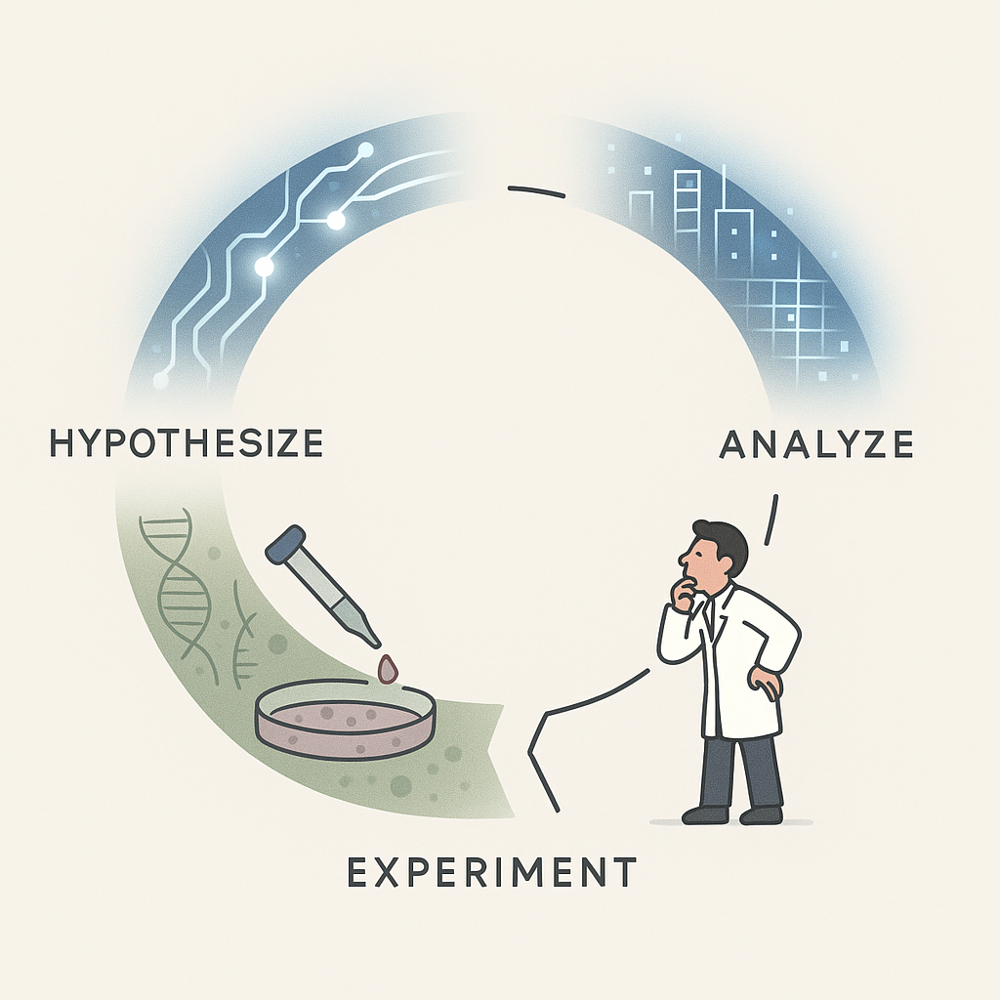

*The current hype cycle might make you believe otherwise, but accelerated learning has fundamental limits when applied to Biology.*

Many new companies in all industries today are built around artificial intelligence (AI)[^1]. This gargantuan shift in 

## Footnotes

[^1]: As opposed to Actual Indians [AI](https://www.businesstoday.in/technology/news/story/700-indian-engineers-posed-as-ai-the-london-startup-that-took-microsoft-for-a-ride-478514-2025-05-31)